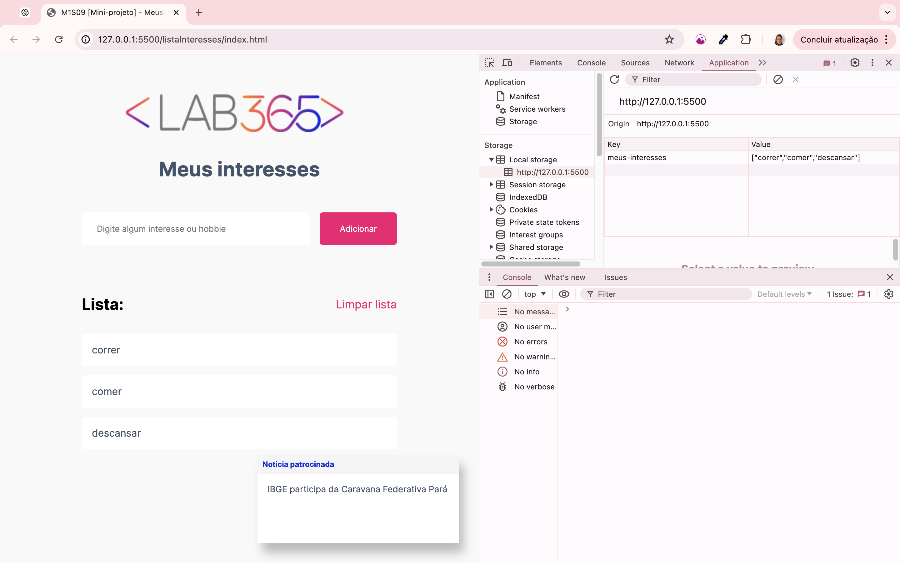

# MINI PROJETO MÓDULO 2 - Semana 5 SENAI e FloripaMaisTech turma TRIP /2024

## 🏦 Sobre o projeto de Lista de Interesses

**Objetivo: Relembrar JavaScript e requisição de API**

Neste mini projeto, iremos criar uma página que possamos adicionar nossos interesses e hobbies, sendo possível armazenar os dados para ter acesso a qualquer momento. Ele consistirá em escrever e adicionar o interesse. Aqui teremos uma seção de notícias de destaque do dia, parecido como um “card” de anuncio patrocinado.

## Sobre o código

- Declaração de Função: Define três funções principais (carregarInteresses, adicionarInteresse, limparInteresses) para manipular a lista de interesses.
- Manipulação do DOM: Seleciona elementos do DOM e altera seu conteúdo (como limpar a lista de interesses e adicionar novos itens).
- Interação com localStorage: Salva, recupera e remove itens do localStorage.
- Event Listeners: Define ações a serem realizadas quando os botões são clicados.
- Atualização Dinâmica da Interface do Usuário: Garante que a lista de interesses seja exibida corretamente na interface do usuário, refletindo as alterações feitas.
- Requisição assíncrona para a API do IBGE para obter notícias. Quando a resposta é recebida, ele seleciona a primeira notícia da lista e a insere no elemento p dentro do contêiner .news no DOM, desde que esses elementos existam. O código também lida com possíveis erros durante a requisição e processamento da resposta, exibindo uma mensagem de erro no console se algo der errado.

## 📉 Diagrama relacional

  

## Melhorias
- Adicionar interesses pela tecla ENTER (método keydown)
- Retorna o cursor para o campo de entrada (método .focus)
- Verifica se já tem o interesse na lista para não repetir (método .icludes)
- Gostaria de ter colocado .mathRandow para buscar e alterar as notícias patrocinadas tornando-as mais dinâmicas

## 🛠️ Construído com

- Trello - aprendendo a criar e mover cards.
- VsCode - aprendendo a usar a ferramenta e suas extensões.
- GitHub - aprendendo a utilizar sempre enviando ou trazendo para meu local o repositório, fazendo alterações...
- HTML e CSS
- Manipulação do DOM
- Javascript
  

## 🧑🏻‍🏫 Professores

* **Nicholas Macedo** - [GitHub](https://github.com/nicholasmacedoo)
* **Yan Esteves** - [GitHub](https://github.com/yanestevesufjf)
* 

## Video de apresentação do MiniProjeto 2

[Video] - (https://drive.google.com/file/d/1u23WEWGNoEiXMYEhZLQJHgfcofG6qicc/view?usp=drive_link)

## 🎁 Expressões de gratidão

* Adorando este curso super podendo fazer perguntas para embasar meu raciocínio 📢;
* Lab365 e todos os monitores;
* Qualquer dúvida ou sugestão de melhorar o código eu aceito;
* Um agradecimento publicamente 🫂 aos melhores amigos de turma que podia ter - TRIP e NATURE!
